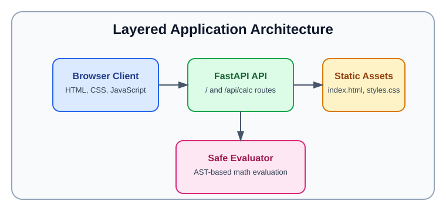

# tutorial-calc

This project is a small calculator application that runs in your web browser. It uses Python to evaluate math expressions like `2+2` and shows the result on a simple page.

## Architecture

This application follows a simple layered architecture with a browser client, a FastAPI web API, and a safe expression evaluation component.

<div align="center">
  
</div>

## What you need

- A Mac or Linux computer
- Python 3 installed
- A terminal or command line window

## Step 1: Open the project folder

Open a terminal and go to the project folder using your home directory shortcut `~`:

```bash
cd ~/dev/tutorial-calc
```

If your project folder is somewhere else, use the same idea with `~` and the folder path after it.

## Step 2: Create and activate the Python environment

This creates a private workspace for this app so it does not change other Python programs on your computer.

```bash
python3 -m venv .venv
source .venv/bin/activate
```

After that, your terminal prompt may show `(.venv)` at the start. That means the project is active.

## Step 3: Install the required tools

Install the software the app needs from the `requirements.txt` file:

```bash
python -m pip install -r requirements.txt
```

## Step 4: Start the calculator app

Run the web server so the calculator is available in your browser:

```bash
python -m uvicorn calculator:app --reload --port 8000
```

This starts the app on your computer. The `--reload` option means the app will restart automatically if you change the code.

## Step 5: Open the app in your browser

Visit this address in your browser:

```text
http://127.0.0.1:8000
```

You will see the calculator page. Enter expressions like `1+1`, `2*3`, or `(2+3)*4`, then submit to see the answer.

## Python tools used and what they do

- `python3`.
  - Runs Python, the language used for this app.
- `venv`.
  - Creates a private Python environment inside the project folder.
  - This keeps the app's tools and packages separate from other Python projects.
- `pip`.
  - Installs the packages listed in `requirements.txt`.
  - It downloads the specific code the app needs.
- `uvicorn`.
  - Runs the web server so the calculator app can be opened in a browser.
  - It listens on port `8000` and handles page requests.
- `FastAPI` and `Pydantic` (installed from `requirements.txt`).
  - `FastAPI` is the web framework that makes the calculator work in a browser.
  - `Pydantic` helps check that the calculator input is valid.

## How to stop the app

If the app is running in the terminal, press:

```text
Ctrl+C
```

That stops the server.

## How to close the Python environment

When you are done, leave the virtual environment with:

```bash
deactivate
```

That returns your terminal to normal mode.

## Notes

- If the browser cannot connect, make sure the app is still running in the terminal.
- If the server is stopped, start it again with the command from Step 4.
- Use `cd ~/Developer/PERSONAL/tutorial-calc` to return to this project folder later.
